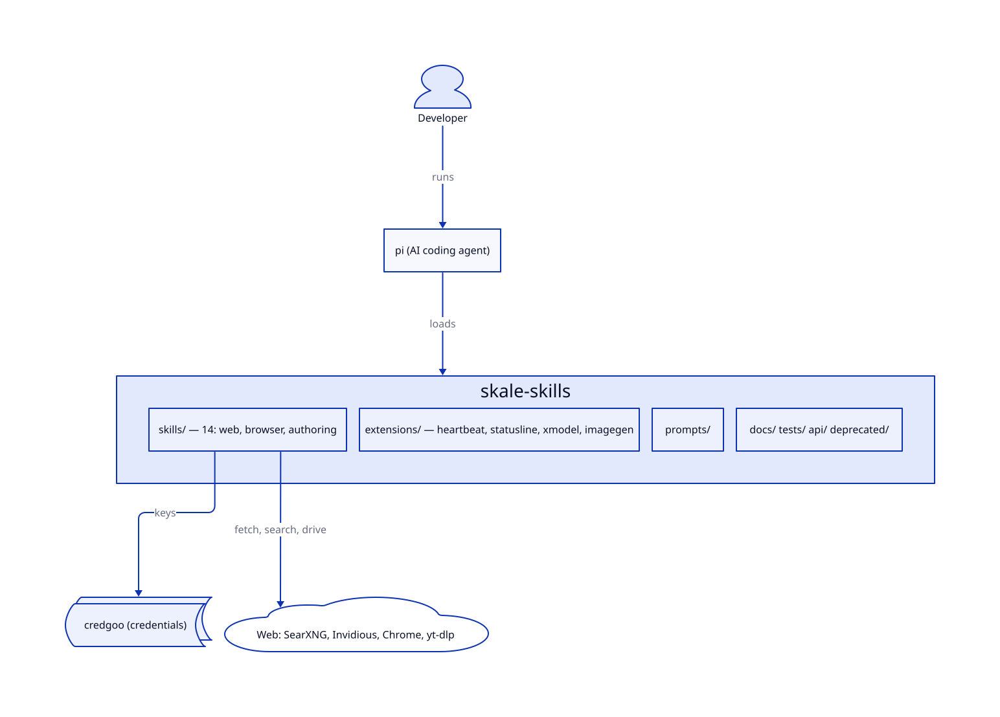
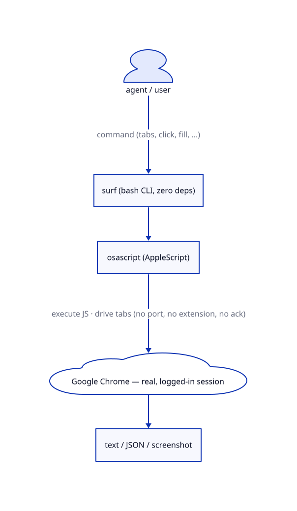
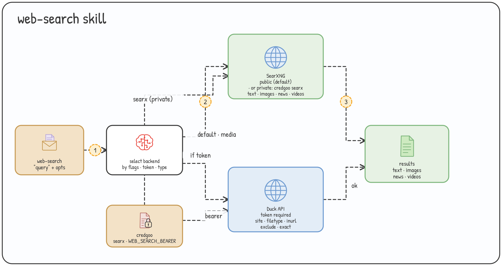
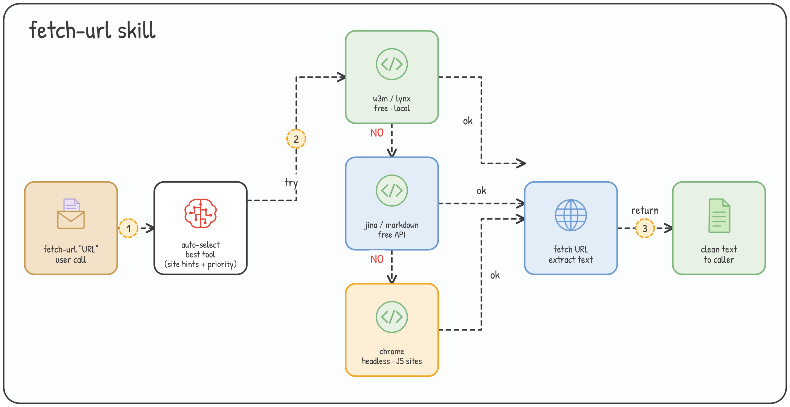
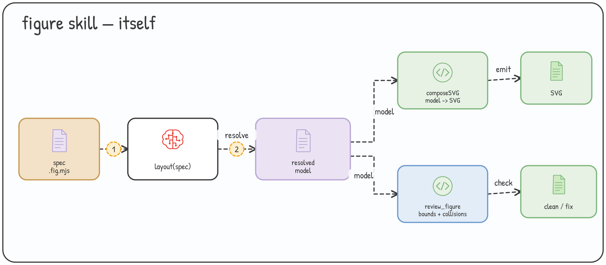

<div align="center">

# Skale Skills

**One install turns any AI coding agent into a web-fetching, browser-driving, image-generating powerhouse.**

[](https://pi.dev)
[](#selective--other-agents)
[](#whats-included)
[](#install)
[](#credentials--credgoo)

A [pi](https://pi.dev) package of **skills, extensions, and prompts** — credential-safe, zero-config defaults, works anywhere that speaks skills/MCP.

</div>

---

## Install

```bash
pi install git:github.com/devskale/skale-skills
```

**One command loads every skill, extension, and prompt into [pi](https://pi.dev).** Public backends work with zero credentials — install and go. To get a skill's global shell command, run its installer from the skill dir (e.g. `./skills/web-search/install.sh`).

> Want to try without installing? `pi -e git:github.com/devskale/skale-skills`
> On Claude Code, Codex, or OpenCode, or need just a few skills? → [Selective & other agents](#selective--other-agents)

---

## Highlights

| | |
|---|---|
| 🔍 **Web search** | SearXNG out-of-the-box + optional Duck API for `site:`/`filetype:` filters, images, news, video |
| 📄 **Page fetch** | Readable text from any URL — auto-selects `w3m`/`lynx`/reader APIs with smart fallback |
| 🏄 **Real-session browser** | Drive your *actual*, logged-in Chrome — no daemon, no debug port, no dialogs |
| 🤖 **Headless browser** | Scrape, screenshot, PDF, a11y audits, CI assertions on isolated Chrome |
| 🎬 **YouTube + media** | Search via Invidious; download video/audio/subtitles/transcripts (yt-dlp) |
| 🎨 **Diagrams & images** | D2 + figure compositing; text→image (Pollinations/TU) the model can see and iterate on |
| 🔐 **Credential-safe** | All keys flow through [credgoo](#credentials--credgoo) — no `.env` with real tokens |
| 🧩 **Cross-agent** | Native pi package; also installable into Claude Code, Codex, OpenCode |

---

## Architecture

<p align="center">
  
</p>

**pi** loads this package (skills + extensions + prompts); the **skiller** CLI manages skills across agents; skills reach **credgoo** for credentials and the **Web** for fetch / search / browser control.

Source: [`docs/architecture.d2`](docs/architecture.d2) · edit and re-render with `d2 docs/architecture.d2 docs/architecture.svg`.

---

## Flagship skills

Three skills are production-hardened — full docs and flow diagrams (most ship test suites too). Each entry indexes its own sub-site of documentation.

### 🏄 `surf` — drive your real Chrome

⭐ **No daemon, no debug port, no extension, no per-connection “Allow remote debugging?” dialog.** 30+ commands, CI assertions, `--json`, zero deps.

<p align="center">
  
</p>

```bash
surf setup && surf tabs
surf select w2.t5 && surf text "h1"            # read a background tab, no focus steal
surf fill "input[name=q]" "x" && surf submit "form"
surf wait ".result" && surf assert '...' '5'    # exit 1 on fail
```

📖 [guide + comparison](docs/browser-use/surf.md) · [command reference](skills/surf/references/commands.md) · [source](skills/surf) · [tests](tests/surf/furious.sh)

### 🔍 `web-search` — backend auto-select

Public SearXNG out-of-the-box (or private via `credgoo searx`); optional Duck API (`credgoo WEB_SEARCH_BEARER`) for advanced filters. Images, news, videos.

<p align="center">
  
</p>

```bash
web-search "agentic browser 2026" --max 10
web-search "swift" --categories images
web-search "openai" --time-range week
```

📖 [SKILL.md](skills/web-search/SKILL.md) · [references](skills/web-search/references) · [source](skills/web-search)

### 📄 `fetch-url` — extract readable text

Readable text from any page; auto-selects the best tool with smart fallback (`w3m`/`lynx`/`chawan` + reader APIs). Works on Reddit, StackOverflow, GitHub, docs.

<p align="center">
  
</p>

```bash
fetch-url "https://news.ycombinator.com"
fetch-url "https://github.com/devskale/skale-skills"
```

📖 [SKILL.md](skills/fetch-url/SKILL.md) · [references](skills/fetch-url/references) · [source](skills/fetch-url)

### 🎨 `figure` — hand-drawn architecture figures

Write a small spec (nodes + edges + numbered step badges), get a consistent **hand-drawn SVG + PNG** — sketchy Excalidraw style, pastel fills, dashed arrows, semantic colour. The bundled Node compositor assembles CC0 icons + the Patrick Hand font. Same spec → identical figure every time.

<p align="center">
  
</p>

📖 [SKILL.md](skills/figure/SKILL.md) · [source](skills/figure)

---

## Quick start

```bash
# 1. Install everything into pi
pi install git:github.com/devskale/skale-skills

# 2. Browse & automate your real Chrome
#    (one-time: Chrome → View → Developer → Allow JavaScript from Apple Events)
surf setup && surf tabs

# 3. Fetch a page · search the web · pull a transcript
fetch-url "https://news.ycombinator.com"
web-search "agentic browser 2026" --max 10
vtd transcript --url 'https://youtube.com/watch?v=…'
```

---

## What's included

### Skills

| Skill | What it does |
|---|---|
| **[surf](skills/surf)** ⭐ | Drive your real, logged-in Chrome via AppleScript — no ack, no deps |
| **[web-search](skills/web-search)** ⭐ | Web search via SearXNG + Duck API (images, news, videos) |
| **[fetch-url](skills/fetch-url)** ⭐ | Web content extraction with smart fallback (Reddit, SO, GitHub, docs) |
| **[figure](skills/figure)** ⭐ | Hand-drawn architecture/pipeline figures from a small spec |
| **[rodney](skills/rodney)** | Headless Chrome automation (scrape, screenshot, PDF, a11y, CI assertions) |
| **[youtube](skills/youtube)** | YouTube search via Invidious with auto-fallback |
| **[video-transcript-downloader](skills/video-transcript-downloader)** | Download video/audio/subtitles/transcripts (yt-dlp) |
| **[d2](skills/d2)** | Diagrams-as-code with the D2 language |

_Retired: 6 skills (todo, agent-skill-creator, agents-md-init, command-creator, improve-skill, readme-write) moved to [`skills/deprecated/`](skills/deprecated/)._

### Extensions (pi)

| Extension | What it does |
|---|---|
| **[heartbeat](extensions/heartbeat.ts)** | Recurring reminder/heartbeat timer the agent can start/stop |
| **[statusline](extensions/statusline.ts)** | Custom footer — machine name, token stats, context usage |
| **[xmodel](extensions/xmodel.ts)** | Custom model providers (zai/GLM, opencode, zen.fg, local endpoints) |
| **[imagegen](extensions/imagegen.ts)** | Text→image (Pollinations/TU via uniinfer) with ASCII preview for iteration |

### Prompts

| Prompt | What it does |
|---|---|
| **[learn](prompts/learn.md)** | Learning and study workflow |

---

## Credentials — credgoo

All keys flow through [credgoo](docs/credgoo.md) — no `.env` with real tokens, no hardcoded secrets:

```bash
credgoo --setup                 # first-time setup
credgoo WEB_SEARCH_BEARER       # fetch a key (prints to stdout)
```

Resolution order: **env var → credgoo → `.env`** (gitignored, last resort). Current services: `WEB_SEARCH_BEARER`, `FETCH_URL_BEARER`, `searx`.

> Public backends (SearXNG, free reader APIs) need **no credentials at all** — they're the zero-config default.

---

## Selective & other agents

### pi (native) — selective install

Install the package once, then activate only the skills you use. **All 14 skills ship in the package** — every one is toggleable in `pi config` (or `pi config -l` for project scope), regardless of which are active. This example turns on only `web-search` and `fetch-url`; the rest are listed as comments — uncomment any to activate:

```jsonc
// ~/.pi/agent/settings.json
{
  "packages": [{
    "source": "git:github.com/devskale/skale-skills",
    "skills": [
      "web-search",   // ✅ active
      "fetch-url",    // ✅ active
      // "surf",                       // uncomment any line to activate
      // "rodney",
      // "youtube",
      // "video-transcript-downloader",
      // "d2",
      // "figure",
    ],
    "extensions": ["extensions/heartbeat.ts", "extensions/statusline.ts", "extensions/xmodel.ts"]
  }]
}
```

Prefer a checklist? `pi config` opens a TUI of every skill/extension from installed packages — **space** to toggle, **Tab** to switch scope.

Filter semantics: omit a key = load **all** of that type · `[]` = load **none** · plain names = **whitelist** (only these load).

📖 [docs/installation.md](docs/installation.md) (precedence + the loose-symlink conflict gotcha) · [install runbook](docs/install-runbook.md)

### Claude Code, Codex, OpenCode

```bash
npx skills@latest add devskale/skale-skills        # skills CLI
openskills install devskale/skale-skills           # OpenSkills

# or symlink any single skill (works everywhere)
ln -s "$PWD/skills/surf" ~/.pi/agent/skills/surf
ln -s "$PWD/skills/surf" ~/.claude/skills/surf
```

---

## `skiller` CLI

Discover, install, and remove skills across agents:

```bash
cd skiller && uv venv && source .venv/bin/activate && uv pip install -e .
skiller discovery <dir>     # scan a local dir for skills
skiller install <name>      # install across agents
```

See [`CONVENTION.md`](CONVENTION.md) and [`RECOMMENDED-SKILLS.md`](RECOMMENDED-SKILLS.md) (external skill sources).

---

## Docs

| Topic | Doc |
|---|---|
| Browser automation (surf, rodney, chrome-devtools-mcp comparison) | [docs/browser-use/](docs/browser-use/) |
| Skill flow diagrams (web-search, fetch-url, surf, figure) | [docs/skill-diagrams.md](docs/skill-diagrams.md) |
| Install & precedence | [docs/installation.md](docs/installation.md) · [runbook](docs/install-runbook.md) |
| Dev loop (edit → ship → clean) | [docs/development.md](docs/development.md) |
| Credentials (credgoo) | [docs/credgoo.md](docs/credgoo.md) |
| Authoring best practices | [agent-skills](docs/agent-skills-best-practices.md) · [AGENTS.md](docs/agents-md-best-practices.md) · [pi-extensions](docs/pi-extensions-best-practices.md) |

### Repo layout

```
skills/      → 8 active skills (surf, rodney, fetch-url, web-search, figure, …)
skills/deprecated/  → 6 retired skills (depth-2; not auto-loaded)
extensions/  → pi extensions (heartbeat, statusline, xmodel, imagegen)
prompts/     → prompt templates (learn)
docs/        → guides + best-practices (browser-use, install, credgoo, …)
guides/      → setup guides (browser tools, Chrome DevTools, rodney)
api/         → reverse-engineered public APIs
skiller/     → skill discovery CLI (Python)
tests/       → per-skill test suites (e.g. tests/surf/furious.sh — 81 checks)
```

---

## Running tests

No global runner — each skill ships its own suite:

```bash
bash tests/fetch-url/test.sh
bash tests/web-search/test.sh
bash tests/rodney/test.sh
bash tests/surf/test.sh && bash tests/surf/furious.sh   # surf: structure + furious live validation
bash tests/imagegen/test.sh                             # imagegen extension (proxy + live gen)
```

---

## Contributing

Every skill follows [`CONVENTION.md`](CONVENTION.md): `SKILL.md` + launcher (symlink resolution, `--update`/`--selfcheck`, auto-update) + `install.sh`/`install.bat` + `.gitignore` + `tests/<name>/test.sh`. Python skills use type hints + Google docstrings + credgoo.

**Don'ts:** `readlink -f` (breaks macOS) · `requirements.txt` · `.env` with real tokens · `amd1.mooo.com` endpoints (migrated to `*.skale.dev`).

---

<div align="center">

<sub>Built with [pi](https://pi.dev) · credentials by [credgoo](docs/credgoo.md) · skills for every agent.</sub>

</div>
