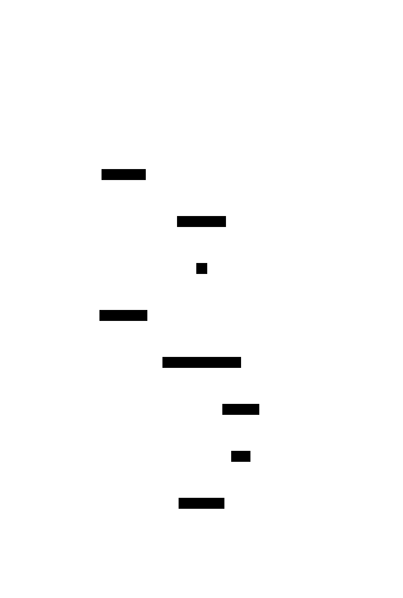

# D2 Diagram Types — Sequence, ER, Class

D2 supports three software-diagram shapes beyond plain boxes-and-arrows. Each is verified below (renders to a correct SVG). **Note the ASCII self-verify limitation:** sequence diagrams ASCII-verify well, but `sql_table` and `class` internals (columns / members) **don't appear in ASCII** — the `.txt` shows only the boxes + relationships. For those, trust `d2 validate` (syntax) and inspect the SVG.

Render any with: `d2 types/<name>.d2 types/<name>.svg`

---

## 1. Sequence diagram — request / protocol flows

When: the order of messages between actors over time (API calls, handshakes, lifecycles). **ASCII self-verifies** (lifelines + `▶` messages are visible).



```d2
flow: {
  shape: sequence_diagram
  client; auth; idp; api
  client -> auth: POST /token
  auth -> idp: verify identity
  idp -> auth: ok
  auth -> client: access_token
  client -> api: GET /resource (Bearer)
  api -> auth: introspect
  auth -> api: valid
  api -> client: 200 resource
}
```
- Wrap the conversation in a container with `shape: sequence_diagram`.
- Declare actors (`client; auth; …`), then each edge is a message in order.
- Arrows render as `▶` on the actors' lifelines; labels go on the arrows.

Source: [`types/sequence.d2`](types/sequence.d2)

---

## 2. ER / data model — `sql_table`

When: database schemas, domain models with columns + foreign keys. **ASCII shows only the table boxes + FK edges — columns are not visible; verify via SVG.**


```d2
vars: { d2-config: { layout-engine: elk } }
orgs: { shape: sql_table
  id: int { constraint: primary_key }
  name: varchar }
users: { shape: sql_table
  id: int { constraint: primary_key }
  email: varchar
  org_id: int { constraint: foreign_key } }
orders: { shape: sql_table
  id: int { constraint: primary_key }
  user_id: int { constraint: foreign_key }
  total: decimal }
users.org_id -> orgs.id
orders.user_id -> users.id
```
- `shape: sql_table`; each field is a column.
- `constraint: primary_key` / `foreign_key` styles the column (PK / FK marker).
- Relate tables by edges between `table.column` keys (`users.org_id -> orgs.id`).

Source: [`types/er.diagram.d2`](types/er.diagram.d2)

---

## 3. Class diagram — types & inheritance

When: OOP / type design — classes with fields/methods and inheritance. **ASCII shows only the class boxes + inheritance edges — members are not visible; verify via SVG.**


```d2
Animal: { shape: class
  + name: string
  + speak(): void }
Dog: { shape: class
  + breed: string
  + fetch(): void }
Cat: { shape: class
  + indoor: bool }
Dog -> Animal: extends
Cat -> Animal: extends
```
- `shape: class`; each entry is a field or method.
- `+`/`-` prefix is a visibility convention (public/private) — rendered as part of the member text.
- Inheritance / association = a labeled edge between classes.

Source: [`types/class.d2`](types/class.d2)

---

## Authoring notes

- **Verify strategy by type:** sequence → read the ASCII (lifelines visible). `sql_table` / `class` → `d2 validate` for syntax, then **open the SVG** to confirm columns/members (ASCII can't show them).
- **Layout:** keep `layout-engine: elk` for ER/class (relationships route cleanly); sequence uses its own internal layout (the `--layout` flag is ignored for sequence too).
- **Fan-in:** many FKs into one table (a hub) tangles — draw representative edges and note the rest.
