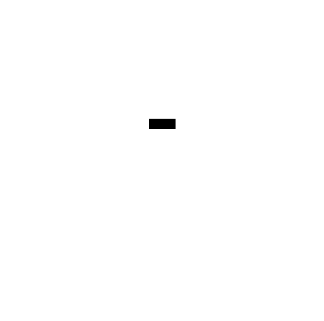

# D2 Recipes — Architecture Patterns

Copy-pasteable starting points for common software-architecture diagrams. All use **ELK layout**, are **ASCII-verified**, and render to **GitHub-safe SVG** (`foreignObject: 0`). Render any with: `d2 recipes/<name>.d2 recipes/<name>.svg`.

> Reuse the shapes vocabulary: `cylinder`/`stored_data` = data store, `queue` = bus/cache/topic, `person` = user/actor, `cloud` = external/edge, `rectangle` = system/container.

---

## 1. Layered architecture

When: classic n-tier — presentation → application → domain → data.


```d2
vars: { d2-config: { layout-engine: elk } }
presentation: "Presentation" { web; mobile }
application: "Application" { auth; orders; billing }
domain: "Domain" { models; rules }
data: "Data" { db: { shape: cylinder }; cache: { shape: queue } }
presentation.web -> application.orders
presentation.mobile -> application.orders
application.orders -> domain.rules
domain.rules -> data.db
domain.models -> data.cache
```
Source: [`recipes/layered.d2`](recipes/layered.d2)

---

## 2. Request flow

When: a single request's path through the stack (linear, easy to self-verify).


```d2
vars: { d2-config: { layout-engine: elk } }
user: { shape: person }
cdn: { shape: cloud; label: "CDN" }
gateway: "API Gateway"
auth: "Auth"
svc: "Order Service"
cache: { shape: queue; label: "Cache" }
db: { shape: cylinder; label: "DB" }
user -> cdn -> gateway -> auth -> svc
svc -> cache
svc -> db
```
Source: [`recipes/request-flow.d2`](recipes/request-flow.d2)

---

## 3. Microservices + message bus

When: event-driven services fanning out from a bus (bus is the hub → clean layout).


```d2
vars: { d2-config: { layout-engine: elk } }
api: "API Gateway"
bus: { shape: queue; label: "Message Bus" }
orders: "Orders"
inventory: "Inventory"
shipping: "Shipping"
api -> bus: publish events
bus -> orders
bus -> inventory
bus -> shipping
```
Source: [`recipes/microservices.d2`](recipes/microservices.d2)

---

## 4. Pub/Sub topic

When: one producer, many subscribers (fan-out from a topic).



```d2
vars: { d2-config: { layout-engine: elk } }
producer: "Producer"
topic: { shape: queue; label: "Topic" }
a: "Subscriber A"; b: "Subscriber B"; c: "Subscriber C"
producer -> topic: publish
topic -> a; topic -> b; topic -> c
```
Source: [`recipes/pubsub.d2`](recipes/pubsub.d2)

---

## 5. C4 Container

When: break a system into its deployable containers + their dependencies (C4 level 2).


```d2
vars: { d2-config: { layout-engine: elk } }
user: { shape: person }
system: "Skale Skills" {
  skills: "skills/ (CLI-driven)"
  extensions: "extensions/ (pi runtime)"
  skiller: "skiller CLI"
}
pi: "pi agent"
credgoo: { shape: cylinder; label: "credgoo" }
user -> pi: runs
pi -> system.skills: loads
pi -> system.extensions: loads
system.skills -> credgoo: keys
```
Source: [`recipes/c4-container.d2`](recipes/c4-container.d2)

---

## 6. Deployment topology

When: infra view — DNS/CDN → load balancer → region (web + API tiers) → DB.


```d2
vars: { d2-config: { layout-engine: elk } }
dns: { shape: cloud; label: "DNS / CDN" }
lb: "Load Balancer"
region: "Region" {
  web: "Web tier (xN)"
  api: "API tier (xN)"
}
db: { shape: cylinder; style.multiple: true; label: "DB (primary + replica)" }
dns -> lb
lb -> region.web
region.web -> region.api
region.api -> db
```
Source: [`recipes/deployment.d2`](recipes/deployment.d2)

---

## Authoring tips (from the SKILL.md gotchas)

- **Layout:** always `layout-engine: elk` (dagre tangles past a few nodes; ASCII ignores `--layout` anyway).
- **Fan-in:** when many nodes point at one sink (e.g. everything → one DB), draw one representative edge and note it — don't draw them all or the layout tangles.
- **Cycles:** small retry loops are fine; long write-backs tangle — prefer a distinct downstream node.
- **Verify before delivery:** `d2 validate x.d2` then render `.txt` and read the ASCII to confirm structure.
- **Self-verify vs delivery:** ASCII uses the exporter's fixed layout, not your `--layout` — verify *structure* in ASCII, trust the SVG by construction.
