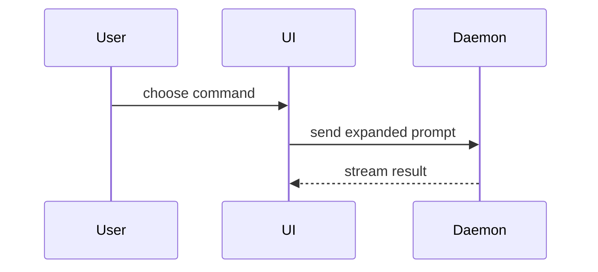

# Code forms — the smallest view that makes the point

The inline half of `visualize`, adapted from
[humanlayer/skills → `show-me`](https://github.com/humanlayer/skills) (MIT). Rewritten for pi:
the Claude-only `Bash(open …)` HTML fallback was dropped (a page is `visualize`'s job — see
below), and the form catalogue now routes explicitly instead of ending in an artifact.

Before you build a page, ask: **does this need a whole HTML page at all?** Many questions are
answered by a **small inline artifact** — a pseudocode block, a call tree, a diff, an annotated
file tree. Those belong **in the chat next to the sentence they support**, not on a URL.

These are valid `visualize` outputs on their own. Pick ONE that matches the question. It is
unlikely you'll need more than one, and almost never all of them.

## When to answer inline vs. build a page

| The question is… | Do this |
|---|---|
| "what does this function do / how does it branch?" | [Pseudocode](#pseudocode) inline |
| "what calls what at runtime?" | [Call tree](#call-tree) inline |
| "how do these components nest, who owns what?" | [Component tree](#component-tree) inline |
| "which files own which responsibility?" | [File tree](#annotated-file-tree) inline |
| "what changes — and the surrounding shape already exists?" | [Diff](#diff) inline |
| "who talks to whom, in what order?" | [Mermaid](#mermaid) inline |
| A dense technical graph, or a set of things to **scan / share / print** | Build the page ([structures.md](structures.md)) |

Inline wins when the answer **fits in one screen** and there's nothing to hand off. When the user
names a deliverable ("for my deck", "send this to the team", "put it in the README") or the content
is a **set** rather than a single explanation, build the page.

## Pseudocode

For logic or an algorithm — the shape, not the syntax. Keep the words, drop the noise.

```text
on(save)
  if content is unchanged
    return cached result
  write new content
  return fresh result
```

## Call tree

For runtime control flow — nesting shows sequence and depth without the arrows.

```text
submitForm
  createSession
    persistPrompt
    launchAgent
  navigateToSession
```

## Component tree

For UI structure, including the state and module boundaries that matter. Annotate with the file
when ownership is the point.

```tsx
<SessionPage> (apps/example/src/routes/session.tsx)
  useSessionEvents()
  <SessionToolbar>
    <RunSkillButton> (packages/ui)
```

## Annotated file tree

For file responsibility or a shallow refactor — a flat tree with one-line roles.

```text
src/
├── commands/       # parses user actions
├── sessions/       # owns session state
└── transport/      # sends API requests
```

For a repo view that needs **kind tags** and richer annotation (every file described, colour-coded
by kind), build the `repo-tree` page ([structures.md § Hierarchy](structures.md)) — the inline tree
above is for the handful of dirs that carry the point.

## Diff

Use when the point is **what changes** and the shape around it already exists. Match the diff
shape to the topic — these are three different shapes, not one generic diff.

**Component change** — keep the existing tree, mark the change:

```diff
 <SessionPage>
   useSessionEvents()
   <SessionToolbar>
+    <RunSkillButton />
   <SessionTimeline>
+    <SkillResultCard />
```

**File-layout change** — folder becomes files:

```diff
 src/
 ├── commands/
+│   └── show-me.ts       # expands the slash command
 ├── sessions/
-└── transport.ts
+└── transport/
+    ├── client.ts
+    └── stream.ts
```

**State / control-flow change** — logic diffs as logic:

```diff
 on(save)
-  write content
+  if content is unchanged
+    return cached result
   write content
+  invalidate cache
```

**Call-tree change** — nesting in a diff:

```diff
 submitForm
   createSession
     persistPrompt
+    expandSkillMention
     launchAgent
-  navigateToSession
+  navigateToSession
+    subscribeToEvents
```

## Mermaid

For component interaction, control flow, or data flow across more than a couple of nodes. Loads
from a CDN in the chat preview; for an offline-capable page use the `mermaid` template
([html-patterns.md](html-patterns.md)).



## When you show the whole block

Show the complete code — not a diff, not a fragment — when most of it is **new**, when omitted
context would **hide ownership or order**, or when the user needs a **copyable target shape**.

```ts
function expandSkill(command: string): string {
  const skillName = command.slice(1)
  return `use the ${skillName} skill`
}
```

## Guidance

- **Place each visual next to the short text it supports.** Not collected at the bottom.
- **Keep only what's needed** to answer the current question — the calls, files, props, states, and
  boundaries that matter now. Trim the rest.
- **Prose stays brief.** Skip the preamble; the visual carries the meaning
  (see [promptlib](promptlib.md) on when a diagram needs a paragraph, redraw it instead).
